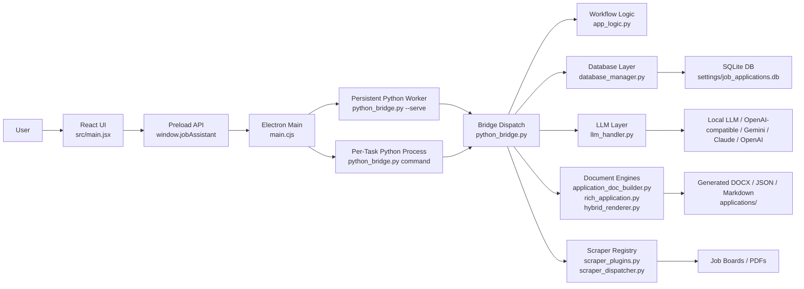
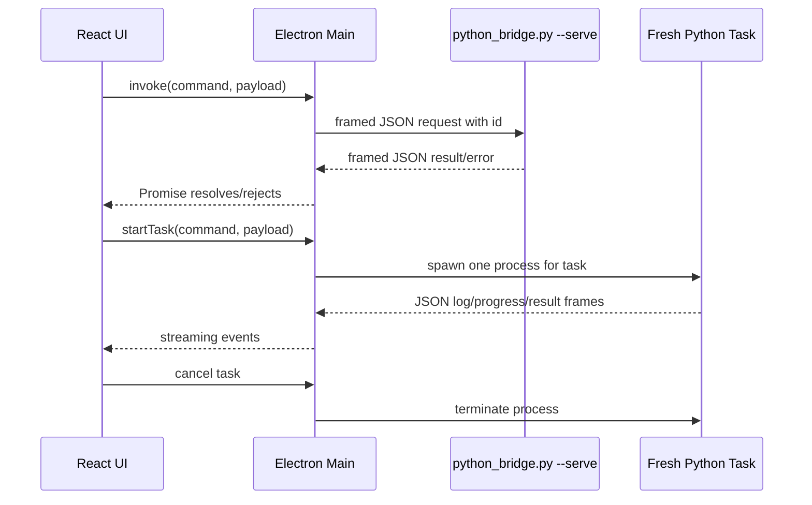
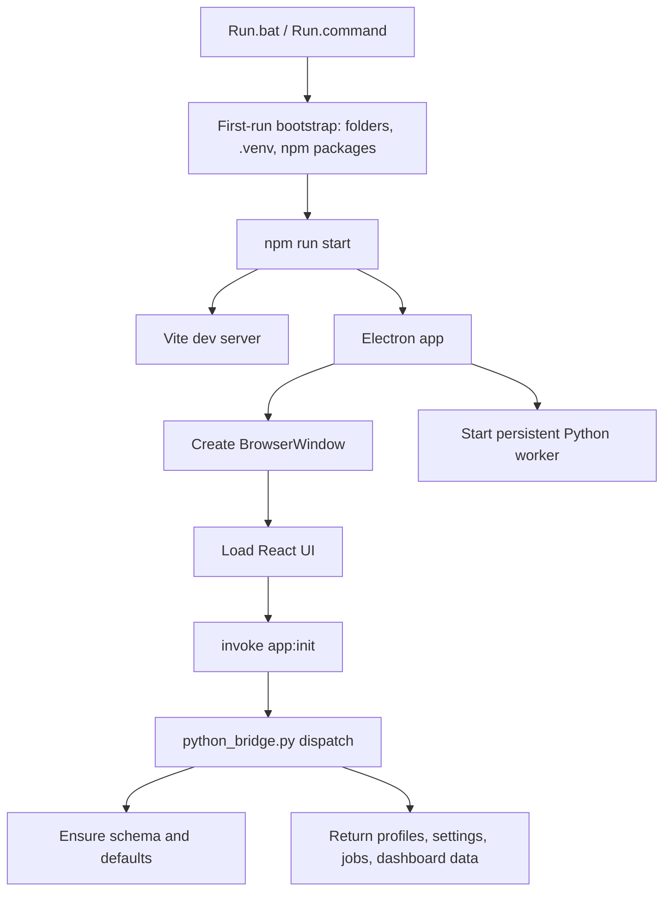
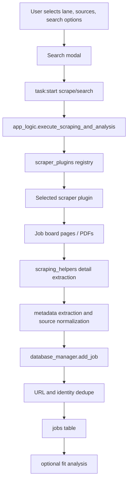
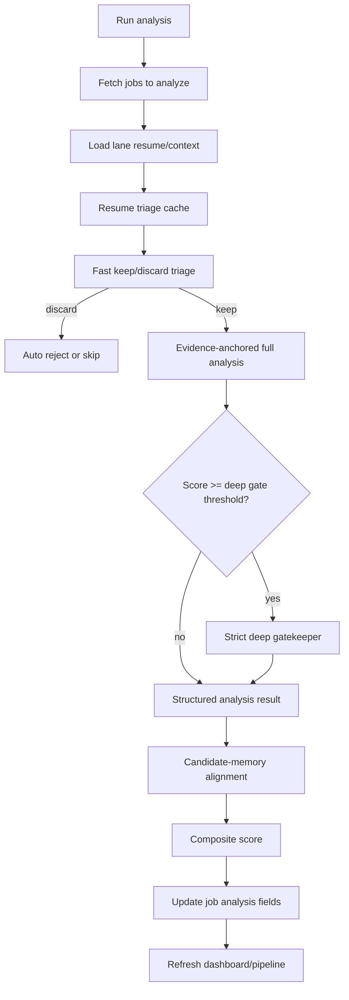
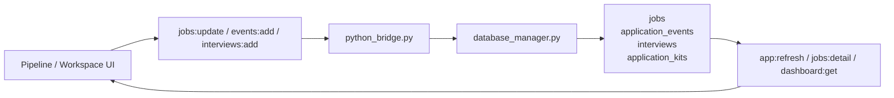
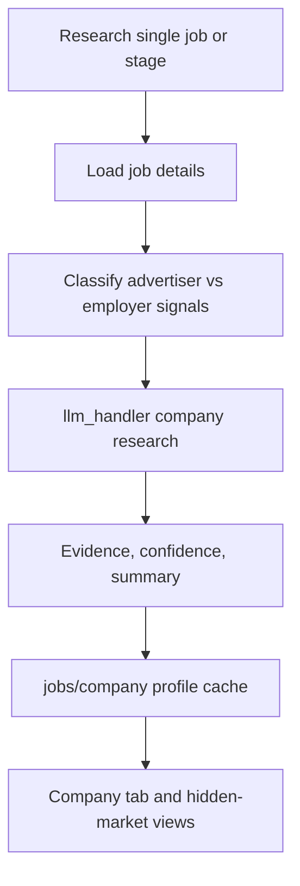
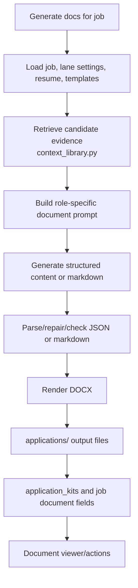
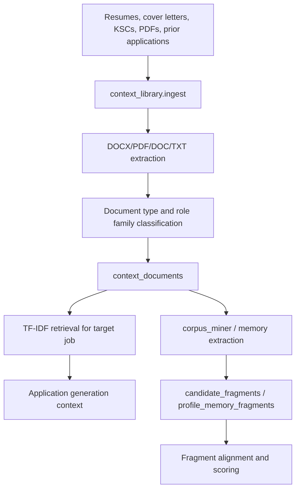
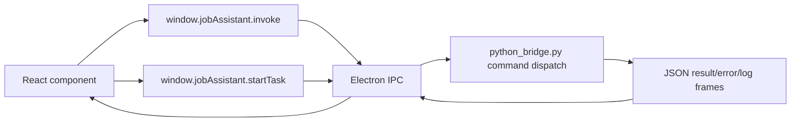

# Architecture, Workflows, And Dataflows

JSE is a local-first desktop application for job discovery, fit analysis,
pipeline management, employer research, and tailored application document
generation. The app is split into an Electron + React frontend and a Python
backend reached only through a JSON command bridge.

JSE is distributed under the MIT License; see `LICENSE` in the repository root.
If it saved you time or sanity on the job hunt, a coffee keeps the project
caffeinated and the commits coming: https://ko-fi.com/keljian

## System Overview

## Source Boundaries

- End-user setup: `README.md`.
- Frontend: `src/main.jsx` and `src/styles.css`.
- Desktop shell: `electron/main.cjs` and `electron/preload.cjs`.
- Bridge: `python_bridge.py`.
- Workflow orchestration: `app_logic.py`.
- Persistence: `database_manager.py` and `db_setup.py`.
- LLM integration: `llm_handler.py`.
- Evidence retrieval: `context_library.py` and `corpus_miner.py`.
- Document generation: `application_doc_builder.py`, `rich_application.py`,
  `hybrid_renderer.py`, and `generate_application.py`.
- Scraping: `scraper_plugins.py`, `scraper_dispatcher.py`,
  `scraping_helpers.py`, `scraper_plugins/`, and legacy built-ins under
  `scrapers/`.
- Runtime/generated data: `settings/`, `applications/`, `older_applications/`,
  `Application templates/`, `Resumes/`, `Backups/`, `.electron-data/`, `dist/`,
  `build/`, `release/`, `installer/`, and `node_modules/`.

## Process Model

The application uses two Python execution paths.

- One-shot calls use the persistent worker so imports and DB warmup happen once.
- Long-running work uses a fresh process so cancellation is reliable.
- In worker mode, stdout is protocol-only newline-delimited JSON. Diagnostics
  must go to stderr.
- `concurrency.py` provides shared pause/resume/cancel primitives for loops, LLM
  calls, and scrapers.

## Primary Workflows

### 1. App Startup

### 2. Search And Scrape

Key data captured:

- title, company, advertiser/source, location, URL
- description and extracted PDF text
- closing date, contact details, work mode, salary signals
- source, keyword, profile/lane association

### 3. Job Fit Analysis

The analysis layer uses `llm_handler.py` and may call:

- local OpenAI-compatible models
- OpenAI-compatible remote APIs
- Gemini
- Claude
- deterministic fallback paths where configured or required

### 4. Pipeline Management

Pipeline stages include:

- `new`
- `interested`
- `applied`
- `interviewing`
- `offer`
- `rejected`
- `rejected_by_company`
- `archived`

Tracked state includes next actions, due dates, priority, application date,
notes, feedback, interviews, rejection reasons, generated documents, and timeline
events.

### 5. Company Research

The research flow is intentionally cautious. It should distinguish recruiter or
advertiser information from the likely hiring company when the ad provides
enough evidence.

### 6. Application Document Generation

Document paths:

- Structured template path: `llm_handler.py` -> `application_doc_builder.py`.
- Rich context path: `rich_application.py`.
- Markdown/plain-text render path: `hybrid_renderer.py`.
- Standalone/manual path: `generate_application.py`.

Outputs can include:

- tailored resume DOCX
- cover letter DOCX
- generated content JSON
- external-LLM prompt Markdown
- review/quality metadata

### 7. Candidate Memory And Context Library

Candidate memory is used to:

- improve application generation grounding
- score alignment against reusable evidence fragments
- suggest lane-fragment affinities
- evolve search terms and targeting signals

## Data Stores

### SQLite

The main SQLite database lives in the configured data directory. Common table
families include:

- profiles/lanes and settings
- app settings and credentials metadata
- scraper plugins and lane scraper overrides
- jobs and job metadata
- application events and interviews
- company intelligence/profile cache
- candidate fragments and profile memory fragments
- context documents and resume triage cache
- generated application kits and local LLM tasks
- campaign actions, plans, and reporting data

### Filesystem

- `settings/`: local app data, `local_llm_settings.json`, browser profiles,
  context corpus cache, and DB when using the app data directory.
- `applications/`: generated application outputs.
- `Application templates/`: local DOCX templates.
- `Resumes/`: local managed resume files.
- `Backups/`: manual or automated backups.
- `.electron-data/`: Electron runtime profile/cache.
- `dist/`, `build/`, `release/`, `installer/`: generated build/package output.

## Command/Data Boundary

The frontend sends command names and JSON payloads to Electron. Electron forwards
them to Python and returns only JSON-serializable results/events.

This boundary keeps UI rendering separate from scraping, LLM calls, database
access, and document generation.

## Privacy And Sharing Model

JSE is local-first and can contain sensitive data. Before sharing source or
build artifacts, review:

- API keys and provider settings
- local endpoint settings in `settings/local_llm_settings.json`
- local SQLite databases
- resumes, cover letters, and generated application documents
- browser/session profiles
- backups and packaged installers
- context corpus caches and extracted document text

Source files should remain free of personal details and live credentials.
Runtime data should stay ignored or be explicitly exported by the user.

## Operational Constraints

- Keep Electron GPU acceleration disabled so local LLMs can use GPU memory.
- Keep the Python worker stdout protocol clean.
- Prefer structured parsing and database helpers over ad hoc string manipulation.
- Keep scraper plugins optional and metadata-driven.
- Treat generated folders and installer copies as outputs, not source of truth.
