# Architecture, Workflows, And Dataflows

JSE is a local-first desktop application for job discovery, fit analysis,
pipeline management, employer research, and tailored application document
generation. The app is split into an Electron + React frontend and a Python
backend reached only through a JSON command bridge.

JSE is distributed under the MIT License; see `LICENSE` in the repository root.
If it saved you time or sanity on the job hunt, a coffee keeps the project
caffeinated and the commits coming: https://ko-fi.com/keljian

## System Overview

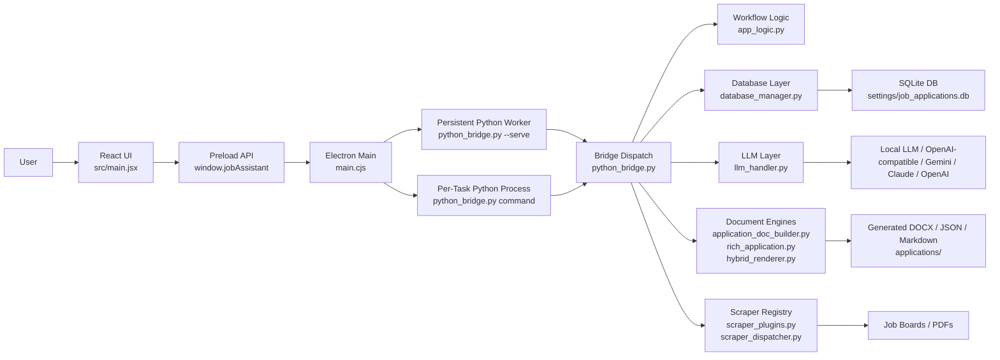
```mermaid
flowchart LR
    User["User"] --> UI["React UI\nsrc/main.jsx"]
    UI --> Preload["Preload API\nwindow.jobAssistant"]
    Preload --> Electron["Electron Main\nmain.cjs"]
    Electron --> Worker["Persistent Python Worker\npython_bridge.py --serve"]
    Electron --> TaskProc["Per-Task Python Process\npython_bridge.py command"]
    Worker --> Bridge["Bridge Dispatch\npython_bridge.py"]
    TaskProc --> Bridge
    Bridge --> Logic["Workflow Logic\napp_logic.py"]
    Bridge --> DB["Database Layer\ndatabase_manager.py"]
    Bridge --> LLM["LLM Layer\nllm_handler.py"]
    Bridge --> Docs["Document Engines\napplication_doc_builder.py\nrich_application.py\nhybrid_renderer.py"]
    Bridge --> Scrapers["Scraper Registry\nscraper_plugins.py\nscraper_dispatcher.py"]
    Scrapers --> Web["Job Boards / PDFs"]
    LLM --> Providers["Local LLM / OpenAI-compatible / Gemini / Claude / OpenAI"]
    DB --> SQLite["SQLite DB\nsettings/job_applications.db"]
    Docs --> Files["Generated DOCX / JSON / Markdown\napplications/"]
```

## Source Boundaries

- End-user setup: `README.md`.
- Frontend: `src/main.jsx` and `src/styles.css`.
- Desktop shell: `electron/main.cjs` and `electron/preload.cjs`.
- Bridge: `python_bridge.py`.
- Workflow orchestration: `app_logic.py`.
- Persistence: `database_manager.py` and `db_setup.py`.
- LLM integration: `llm_handler.py`.
- Evidence retrieval: `context_library.py` and `corpus_miner.py`.
- Document generation: `application_doc_builder.py`, `rich_application.py`,
  `hybrid_renderer.py`, and `generate_application.py`.
- Scraping: `scraper_plugins.py`, `scraper_dispatcher.py`,
  `scraping_helpers.py`, and custom plugin folders under `scraper_plugins/`.
- Runtime/generated data: `settings/`, `applications/`, `older_applications/`,
  `Application templates/`, `Resumes/`, `Backups/`, `.electron-data/`, `dist/`,
  `build/`, `release/`, `installer/`, and `node_modules/`. Source/development
  runs keep these paths under the project; packaged builds keep user-owned data
  under Electron's persistent user-data directory so application updates cannot
  replace it.

## Process Model

The application uses two Python execution paths.

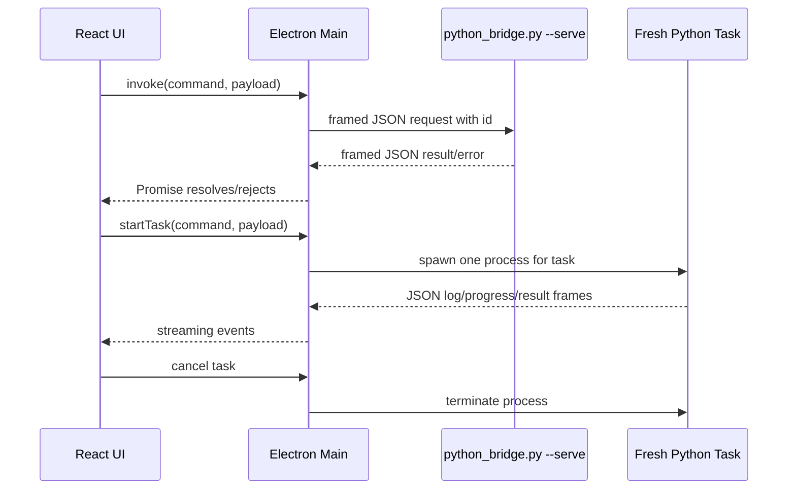
```mermaid
sequenceDiagram
    participant UI as React UI
    participant Main as Electron Main
    participant Worker as python_bridge.py --serve
    participant Task as Fresh Python Task

    UI->>Main: invoke(command, payload)
    Main->>Worker: framed JSON request with id
    Worker-->>Main: framed JSON result/error
    Main-->>UI: Promise resolves/rejects

    UI->>Main: startTask(command, payload)
    Main->>Task: spawn one process for task
    Task-->>Main: JSON log/progress/result frames
    Main-->>UI: streaming events
    UI->>Main: cancel task
    Main->>Task: terminate process
```

- One-shot calls use the persistent worker so imports and DB warmup happen once.
- Long-running work uses a fresh process so cancellation is reliable.
- In worker mode, stdout is protocol-only newline-delimited JSON. Diagnostics
  must go to stderr.
- `concurrency.py` provides shared pause/resume/cancel primitives for loops, LLM
  calls, and scrapers.

## Primary Workflows

### 1. App Startup

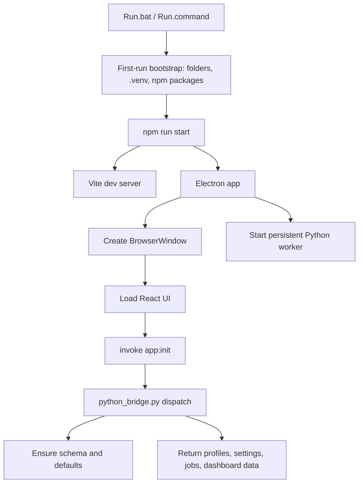
```mermaid
flowchart TD
    Start["Run.bat / Run.command"] --> Bootstrap["First-run bootstrap: folders, .venv, npm packages"]
    Bootstrap --> Npm["npm run start"]
    Npm --> DevServer["Vite dev server"]
    Npm --> Electron["Electron app"]
    Electron --> Window["Create BrowserWindow"]
    Electron --> Worker["Start persistent Python worker"]
    Window --> React["Load React UI"]
    React --> Init["invoke app:init"]
    Init --> Bridge["python_bridge.py dispatch"]
    Bridge --> DBSetup["Ensure schema and defaults"]
    Bridge --> Snapshot["Return profiles, settings, jobs, dashboard data"]
```

### 2. Search And Scrape

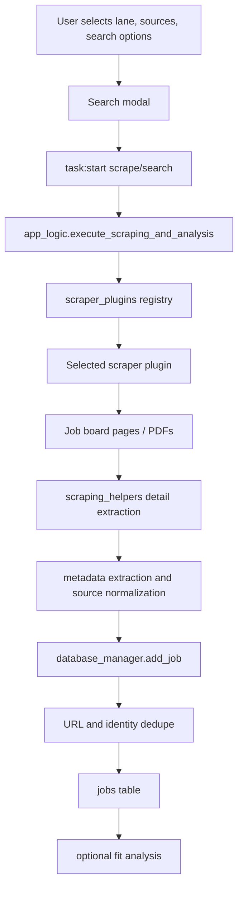
```mermaid
flowchart TD
    User["User selects lane, sources, search options"] --> UI["Search modal"]
    UI --> Task["task:start scrape/search"]
    Task --> Logic["app_logic.execute_scraping_and_analysis"]
    Logic --> Registry["scraper_plugins registry"]
    Registry --> Plugin["Selected scraper plugin"]
    Plugin --> Web["Job board pages / PDFs"]
    Web --> Extract["scraping_helpers detail extraction"]
    Extract --> Normalize["metadata extraction and source normalization"]
    Normalize --> Store["database_manager.add_job"]
    Store --> Dedupe["URL and identity dedupe"]
    Dedupe --> Jobs["jobs table"]
    Jobs --> OptionalAnalysis["optional fit analysis"]
```

Key data captured:

- title, company, advertiser/source, location, URL
- description and extracted PDF text
- closing date, contact details, work mode, salary signals
- source, keyword, profile/lane association

### 3. Job Fit Analysis

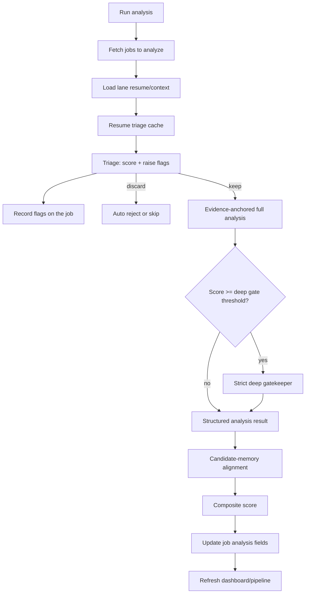
```mermaid
flowchart TD
    Request["Run analysis"] --> Jobs["Fetch jobs to analyze"]
    Jobs --> Resume["Load lane resume/context"]
    Resume --> TriageCache["Resume triage cache"]
    TriageCache --> FastTriage["Triage: score + raise flags"]
    FastTriage --> Flags["Record flags on the job"]
    FastTriage -->|discard| Reject["Auto reject or skip"]
    FastTriage -->|keep| Full["Evidence-anchored full analysis"]
    Full --> Gate{"Score >= deep gate threshold?"}
    Gate -->|yes| Deep["Strict deep gatekeeper"]
    Gate -->|no| Structured["Structured analysis result"]
    Deep --> Structured
    Structured --> Fragments["Candidate-memory alignment"]
    Fragments --> Score["Composite score"]
    Score --> DB["Update job analysis fields"]
    DB --> UI["Refresh dashboard/pipeline"]
```

Triage does two jobs in one call: it scores the role, and it raises flags on it.
A flag is a specific, checkable concern, and each one names the ad's own
requirement plus why the resume does not meet it. There are five types:
`credential_gate`, `domain_mismatch`, `seniority_below`, `seniority_above` and
`evidence_gap`. A deterministic pre-pass pulls the ad's mandatory-requirement
lines out first, and triage now receives the full advertisement rather than a
3,500-character extract, so a registration buried at the bottom still gets seen.

**Flags do not gate anything.** No code path branches on them. They never block
document generation, never cap a score, and never drop a role from a listing or
a shortlist packet.

That is a deliberate correction. An earlier version of this stage returned a
skip / stretch / clear verdict and refused to generate documents on a skip. It
put a model in the position of overruling the person using the tool, on a
judgement about their own career that the model is badly placed to make. Flags
keep all of the detection and none of the authority.

The rules that survived are the ones that keep flags worth reading. A flag has
to name the ad's requirement or it gets dropped, because unevidenced flags are
noise and noise is what teaches people to skim past the real ones. Low
confidence is kept and labelled rather than discarded, since the reader is the
one deciding. Flags added by hand survive re-analysis, because nothing can
re-derive "the recruiter would not name the client".

Flagging costs no extra LLM call. It lives inside triage precisely because
nothing branches on it, so a separate pass bought nothing while doubling the
per-job round trips against a single-slot local model. Folding it in also
widened coverage: triage runs on every job, where the old stage only ran on the
ones that had already cleared the threshold.

Triage reports `seniority_direction` whether or not it raises a seniority flag,
which feeds the two-track document strategy below.

#### What the scoring chain is judged against

Every scoring pass — triage, full analysis, deep gatekeeper — is judged against
a **positioning doctrine**: which role families are on target, at what level, in
what salary band. `llm.prompts.POSITIONING_DOCTRINE` is the default, and a lane
can override it with `profiles.positioning_doctrine` (Settings > Lane).

The override exists because the doctrine was global while the app is multi-lane.
The default describes the candidate's primary market and retires families that
sit below it, so a secondary lane hunting a lower level got its own target roles
capped by a doctrine written about a different search. A blank override means
"use the default", which is right for the lane the default was written for.

Alongside it, each pass receives an **ACTIVE LANE BRIEF** built from the lane's
`lane_intent`, `target_titles`, `target_domains`, `seniority`, `must_have_terms`
and `avoid_terms`. The brief outranks the doctrine on role family and level for
that pass: a role matching the lane's stated targets is on-target by definition,
and the retired-track and level-mismatch caps do not apply to it. Every other
cap and knockout still does. Before this existed the lane's targets reached the
model nowhere at all — they were used only for a token-overlap check — so the
model judged level against the doctrine's primary track on every lane.

Lane weighting terms (`boost_terms`, `penalty_terms`) shift the triage score by
at most +10 / -15 in total. They split on semicolons, commas or newlines.

#### Borderline rescue

A role scoring under the full-analysis threshold is escalated to full analysis
anyway when its title reads as one of the lane's own targets. Full analysis is
the only stage that can promote as well as demote, so a single noisy triage
number does not get the last word on an on-lane role.

The rescue is deliberately not gated on `keep` or the keep threshold. The caps
it exists to second-guess are level judgements, and those land at 40 with
`keep=false` — below both gates — so a rescue requiring either could never reach
the roles that needed it. It is gated on `TRIAGE_RESCUE_FLOOR` instead, and on
the absence of a high-confidence `credential_gate` flag: level is a matter of
strategy, but a mandatory registration the resume cannot evidence is not, and no
lane brief makes the candidate eligible for it.

Title matching is prefix-based rather than exact, so ordinary word forms of the
same term count (technician/technical, teacher/teaching). Titles of one or two
words must match in full; longer ones need two overlaps, so a stray shared word
is not enough on its own.

The analysis layer uses `llm_handler.py` and may call:

- local OpenAI-compatible models
- OpenAI-compatible remote APIs
- Gemini
- Claude
- deterministic fallback paths where configured or required

### 4. Pipeline Management

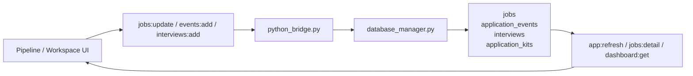
```mermaid
flowchart LR
    UI["Pipeline / Workspace UI"] --> Update["jobs:update / events:add / interviews:add"]
    Update --> Bridge["python_bridge.py"]
    Bridge --> DB["database_manager.py"]
    DB --> Tables["jobs\napplication_events\ninterviews\napplication_kits"]
    Tables --> Refresh["app:refresh / jobs:detail / dashboard:get"]
    Refresh --> UI
```

Pipeline stages include:

- `new`
- `interested`
- `applied`
- `interviewing`
- `offer`
- `rejected`
- `rejected_by_company`
- `archived`

Tracked state includes next actions, due dates, priority, application date,
notes, feedback, interviews, rejection reasons, generated documents, and timeline
events.

### 4a. Funnel Feedback Loop

Outcomes drive learning. When a job reaches `applied`, an immutable
`application_outcomes` snapshot records its dimensional state; the outcome then
advances monotonically (`pending` → `interview` → `final_round` → `runner_up` →
`offer`, or `declined` / `ghosted` / `withdrawn`). The snapshot has no foreign
key to `jobs`, so it (and the underlying interview rows) survive lane deletion
and duplicate cleanup — jobs carrying real history are reassigned to a fallback
lane rather than hard-deleted.

`final_round` and `runner_up` exist because a first-round screen-out and a
"second by a very small margin" used to collapse to the same `interview` →
`declined` pair, hiding the results that carry the most information.
`interview_stage_reached` and `loss_reason` record how far a near miss got and
what ended it. Two conversion rates are therefore reported, not one:
application → interview (an allocation problem) and interview → final round (a
competition problem).

Each snapshot also records a `channel`
(`board` / `recruiter` / `warm_referral` / `direct_outreach`), derived from the
job's source and employer type. Externally-logged (`Manual`) applications are
left unattributed rather than guessed, since only the user knows whether one came
from a referral.

A snapshot whose job row was deleted is reconstructed from `job_postings` first
(the normalized posting survives the cascade and carries every dimension), then
from `application_events` (the company-intelligence blob and document filenames).
Only when nothing is recoverable is the row marked `unresolved`: it still counts
in the headline totals — the application really happened — but is excluded from
every dimension breakdown and reported as `excluded_unresolved`, rather than
being bucketed as `unknown` where it diluted every dimension it touched.

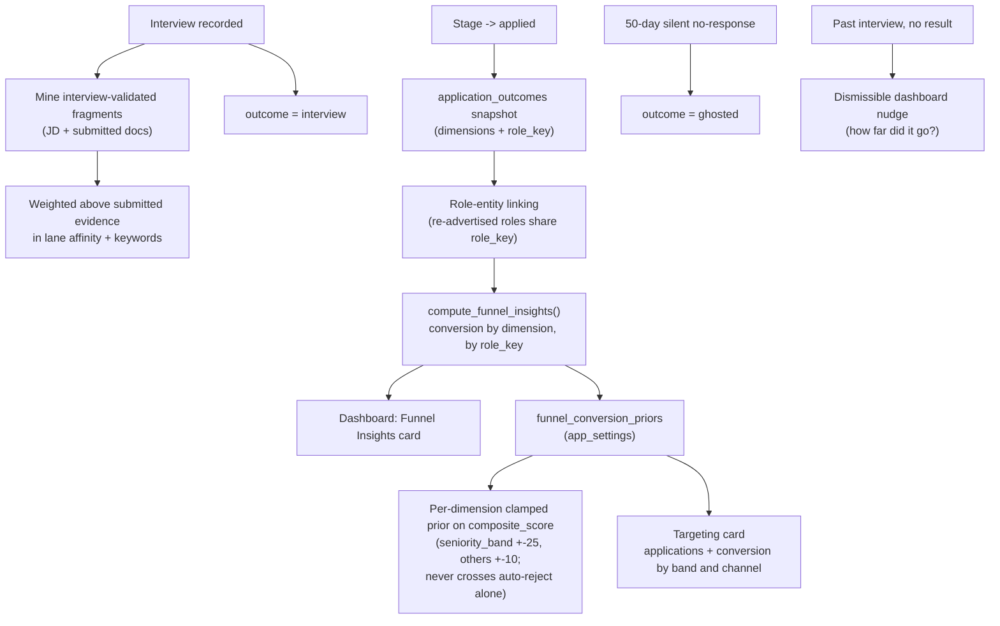
```mermaid
flowchart TD
    Applied["Stage -> applied"] --> Snapshot["application_outcomes snapshot\n(dimensions + role_key)"]
    Interview["Interview recorded"] --> OutcomeInterview["outcome = interview"]
    Interview --> Mine["Mine interview-validated fragments\n(JD + submitted docs)"]
    Mine --> Affinity["Weighted above submitted evidence\nin lane affinity + keywords"]
    Snapshot --> RoleKey["Role-entity linking\n(re-advertised roles share role_key)"]
    RoleKey --> Insights["compute_funnel_insights()\nconversion by dimension, by role_key"]
    Insights --> Card["Dashboard: Funnel Insights card"]
    Insights --> Priors["funnel_conversion_priors\n(app_settings)"]
    Priors --> Composite["Per-dimension clamped prior on composite_score\n(seniority_band +-25, others +-10;\nnever crosses auto-reject alone)"]
    Priors --> Targeting["Targeting card\napplications + conversion by band and channel"]
    Ghost["50-day silent no-response"] --> OutcomeGhost["outcome = ghosted"]
    Nudge["Past interview, no result"] --> Prompt["Dismissible dashboard nudge\n(how far did it go?)"]
```

All conversion statistics aggregate by `role_key`, never by job id. Insights and
priors are pure SQL/Python (no LLM); only interview-validated fragment mining
uses a model. See `database_manager.compute_funnel_insights`,
`backfill_application_outcomes`, and `composite_score_with_prior`.

### 4b. Targeting — Band-Weighted Scoring And The Warm Channel

Discovery is not the constraint (16,157 jobs scraped against 156 applications);
allocation is. Two mechanisms act on that.

**Band-weighted priors.** Observed conversion by seniority band spans ~20x
(bridging titles 25%, manager-lead 1.2%, against a 5.8% baseline). A flat ±10
clamp with a x40 scale cannot express that, so priors carry a per-dimension
clamp and scale: `PRIOR_CLAMP_BY_DIMENSION` / `PRIOR_SCALE_BY_DIMENSION` grant
`seniority_band` ±25 at x100 while every other dimension keeps the conservative
±10 at x40. `conversion_prior_delta` combines the qualifying deltas as an average
weighted by each dimension's clamp, so a dimension explicitly granted more
authority is not diluted back to ±10 by three ±10 neighbours (with equal clamps
it reduces exactly to the previous arithmetic mean).

The auto-reject guard is unchanged and non-negotiable: a prior can never, on its
own, push a job across `AUTO_REJECT_THRESHOLD` in either direction. Band is
advisory — it is surfaced with its observed rate via `band_triage_note` and
`explain_composite_score`, and it never rejects a job by itself.

**Composite reweighting.** `calculate_composite_score` moved from 80/20 to 60/40
(`COMPOSITE_MATCH_WEIGHT` / `COMPOSITE_FRAGMENT_WEIGHT`), because match_score did
not separate outcomes at all: the 70-79 band converted at 5.6% and the 80-89 band
at 6.5%. The weights are named constants shared by `llm_handler._compose_score`
and mirrored in `src/main.jsx`.

**Warm channel.** `hidden_market_leads` held zero rows because every path into it
started from a target mined out of advert data — and the employers worth a warm
approach are the ones not advertising. `hiddenMarket:addTarget` creates a lead
against a named employer with no scraped job behind it. `warm_contacts` is the
supporting contact book, kept deliberately separate from `people` (which is the
*candidate's* identity, linked to `candidate_fragments` via
`profiles.person_id` — writing employer contacts into it would scope the
candidate's own memory fragments to strangers). A week with zero warm activity
raises a dashboard nudge.

**Channel warmth on the job.** The four-channel vocabulary
(`board` / `recruiter` / `warm_referral` / `direct_outreach`) originally existed
only on outcome snapshots, so warmth was known one step after it could be acted
on. `jobs.channel` stores an explicit channel that overrides
`application_channel`'s derivation, and `channel_warmth` derives a rank on top:
warm (a referral or direct outreach — the routes where an application is not
judged side by side against a better-matched candidate), named contact (a human
is identified but the route is still the portal), or cold.

Warmth is derived rather than stored as a fifth channel value on purpose: the
finer distinction informs ranking without splitting the reporting dimension that
Funnel Insights has already backfilled.

`_sort_campaign_candidates` ranks by warmth **before** the campaign score, so a
moderate warm role beats a stronger cold one. On the pipeline board
(`command_jobs_list`) warmth sits above the score but below priority and due
date, so an overdue action still leads. `warm_contact_index` is one grouped
query — same pattern as `recurrence_index` — matched against each job's real
employer first, so a recruiter-listed role still finds the contact at the end
client. `get_channel_mix` reports how cold the recent applied mix is and which
live roles already have a contact behind them; that is a different question from
`get_warm_channel_activity`, which asks only whether any hidden-market work
happened.

### 5. Company Research

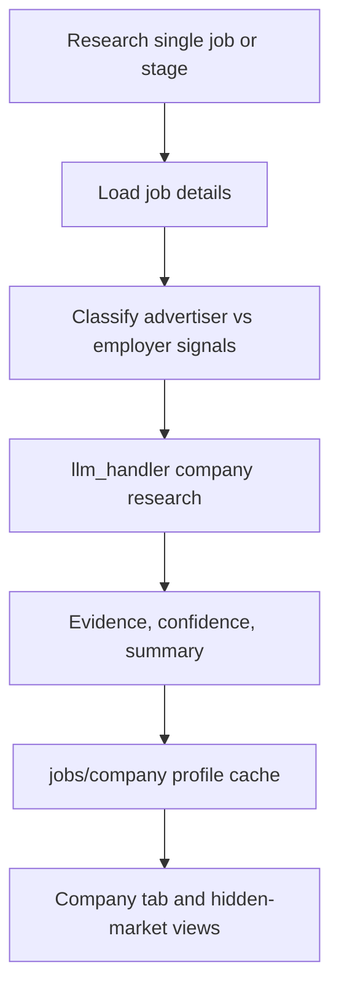
```mermaid
flowchart TD
    Trigger["Research single job or stage"] --> Detail["Load job details"]
    Detail --> Classify["Classify advertiser vs employer signals"]
    Classify --> LLM["llm_handler company research"]
    LLM --> Evidence["Evidence, confidence, summary"]
    Evidence --> DB["jobs/company profile cache"]
    DB --> UI["Company tab and hidden-market views"]
```

The research flow is intentionally cautious. It should distinguish recruiter or
advertiser information from the likely hiring company when the ad provides
enough evidence.

#### Intelligence workspace

`database_manager.get_hidden_market_intel` now produces an explainable,
lane-aware intelligence payload rather than anonymous aggregate counts. Target
records retain source-job evidence, identity reasons and counter-evidence,
confidence, momentum, a recommended next action, and an opportunity score based
on fit, recurrence, recency, confidence, contactability, momentum, and observed
outreach outcomes.

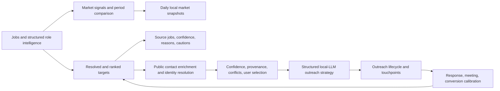
```mermaid
flowchart LR
    Jobs["Jobs and structured role intelligence"] --> Signals["Market signals and period comparison"]
    Jobs --> Targets["Resolved and ranked targets"]
    Targets --> Evidence["Source jobs, confidence, reasons, cautions"]
    Targets --> Contacts["Public contact enrichment and identity resolution"]
    Contacts --> Review["Confidence, provenance, conflicts, user selection"]
    Review --> Strategy["Structured local-LLM outreach strategy"]
    Strategy --> Leads["Outreach lifecycle and touchpoints"]
    Leads --> Outcomes["Response, meeting, conversion calibration"]
    Outcomes --> Targets
    Signals --> Snapshots["Daily local market snapshots"]
```

Durable state lives in `hidden_market_leads`, `hidden_market_strategies`,
`hidden_market_contact_research`, and `market_intelligence_snapshots`. Strategies and
snapshots contain no cloud requirement; the configured local model is used for
AI angles, while deterministic aggregation and fallback skill/work-mode
extraction keep the workspace useful without it.

Contact enrichment is implemented in `contact_research.py`. It reconciles
proximity-bound contact records extracted from source ads, discards non-person
labels, and uses exact-email or full-name evidence when attaching public search
metadata and organisation pages. The UI exposes one recommendation and at most
two credible alternatives, with weaker candidates folded into diagnostics.
Explicit selection is required only when independently supported identities
remain close. It never logs into or scrapes authenticated LinkedIn pages. Cached
research is refreshed after seven days or whenever the research model changes.

### 6. Application Document Generation

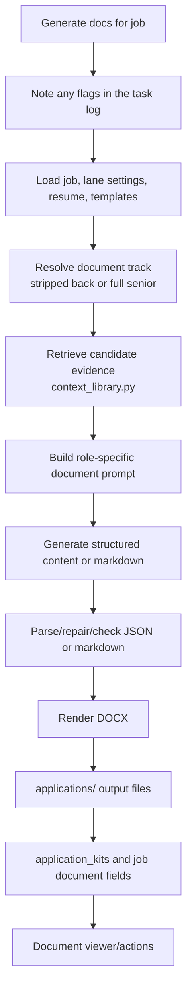
```mermaid
flowchart TD
    User["Generate docs for job"] --> Note["Note any flags in the task log"]
    Note --> Load["Load job, lane settings, resume, templates"]
    Load --> Track["Resolve document track\nstripped back or full senior"]
    Track --> Context["Retrieve candidate evidence\ncontext_library.py"]
    Context --> Prompt["Build role-specific document prompt"]
    Prompt --> LLM["Generate structured content or markdown"]
    LLM --> Validate["Parse/repair/check JSON or markdown"]
    Validate --> Render["Render DOCX"]
    Render --> Save["applications/ output files"]
    Save --> Kit["application_kits and job document fields"]
    Kit --> UI["Document viewer/actions"]
```

Document paths:

- Structured template path: `llm_handler.py` -> `application_doc_builder.py`.
- Rich context path: `rich_application.py`.
- Markdown/plain-text render path: `hybrid_renderer.py`.
- Standalone/manual path: `generate_application.py`.

Outputs can include:

- tailored resume DOCX
- cover letter DOCX
- generated content JSON
- external-LLM prompt Markdown
- review/quality metadata

**Two-track strategy.** Overqualification screening on support-grade roles is a
measured rejection cause, where the same senior evidence that wins a Head-of
role gets the application binned. `database_manager.document_track` resolves
**stripped back** or **full senior** from signals already computed: the
`seniority_direction` triage reported, the title band, and the salary band.
Triage's judgement is decisive on its own because it read the whole ad against
the resume. The keyword heuristics need two agreeing signals, so one
support-grade word in a manager title cannot strip a senior resume.
`jobs.document_track` pins a manual override that survives re-analysis.

On the stripped track `rich_application.resume_task` writes to the ad's actual
scope, keeping the same real employers, titles and dates while changing emphasis
and depth. Facts never change. `cover_task` adds a positioning instruction to
answer the level question directly in one honest sentence rather than leaving
the screener to answer it.

**Nothing blocks generation.** `bridge.jobs.report_job_flags` runs at the top of
both generation commands and writes any flags to the task log. That is all it
does. The flags are already on the card and in the workspace by then, so if the
decision is to apply anyway, that is the decision.

### 7. Candidate Memory And Context Library

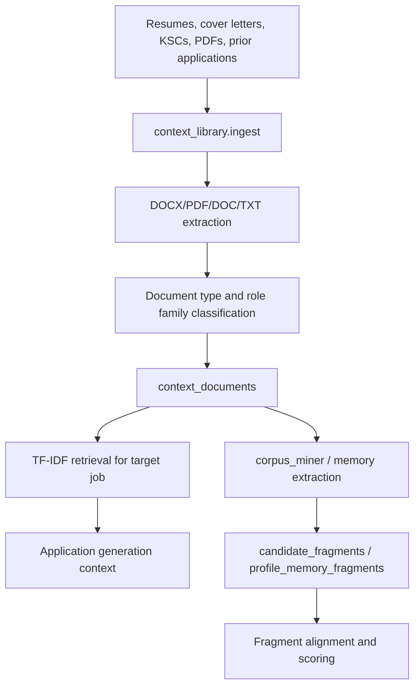
```mermaid
flowchart TD
    Sources["Resumes, cover letters, KSCs, PDFs, prior applications"] --> Ingest["context_library.ingest"]
    Ingest --> Extract["DOCX/PDF/DOC/TXT extraction"]
    Extract --> Classify["Document type and role family classification"]
    Classify --> Corpus["context_documents"]
    Corpus --> Retrieve["TF-IDF retrieval for target job"]
    Retrieve --> Generation["Application generation context"]
    Corpus --> Mine["corpus_miner / memory extraction"]
    Mine --> Fragments["candidate_fragments / profile_memory_fragments"]
    Fragments --> Analysis["Fragment alignment and scoring"]
```

Candidate memory is used to:

- improve application generation grounding
- score alignment against reusable evidence fragments
- suggest lane-fragment affinities
- evolve search terms and targeting signals

## Data Stores

### SQLite

The main SQLite database lives in the configured data directory. Common table
families include:

- profiles/lanes and settings
- app settings and credentials metadata
- scraper plugins and lane scraper overrides
- jobs and job metadata
- application events and interviews
- application outcome snapshots (`application_outcomes`, the funnel feedback loop)
- company intelligence/profile cache
- candidate fragments and profile memory fragments
- context documents and resume triage cache
- generated application kits and local LLM tasks
- campaign actions, plans, and reporting data

### Filesystem

The paths below are project-relative in development. In packaged builds,
`settings/`, `applications/`, and `older_applications/` live under Electron's
persistent user-data directory. The first updater-capable build migrates legacy
install-tree data there without overwriting existing destination files.

- `settings/`: local app data, `local_llm_settings.json`, browser profiles,
  context corpus cache, and DB when using the app data directory.
- `applications/`: generated application outputs.
- `Application templates/`: local DOCX templates.
- `Resumes/`: local managed resume files.
- `Backups/`: manual or automated backups.
- `shortlists/`: triage packets written by `jobs:exportShortlist`. Configurable
  via the `shortlists_dir` app setting so it can point at a watched folder.
- `defaults/`: the only first-run content that ships inside the installer.
  Committed and neutral by definition — `search_terms.json` and any scraper
  plugins that are genuinely product rather than personal. Seeded into the user
  data directory on first launch, never overwriting existing files. The live
  `search_terms.json` and `scraper_plugins/` at the repo root are gitignored
  personal data and are deliberately *not* packaged; see `defaults/README.md`.
- `.electron-data/`: Electron runtime profile/cache.
- `dist/`, `build/`, `release/`, `installer/`: generated build/package output.

## Module Layout

The four monoliths were split into layered packages. Each keeps a facade or
entrypoint at its original path, so no caller changed.

| Was | Now | Entry point |
| --- | --- | --- |
| `database_manager.py` 9,191 lines | `db/` — 12 modules, largest 2,264 | `database_manager.py` (481-line facade) |
| `llm_handler.py` 3,644 lines | `llm/` — 7 modules, largest 1,217 | `llm_handler.py` (139-line facade) |
| `python_bridge.py` 3,509 lines | `bridge/` — 9 modules, largest 762 | `python_bridge.py` (139-line entrypoint) |
| `src/main.jsx` 6,072 lines | `src/lib/` + `src/components/` — 13 modules, largest 863 | `src/main.jsx` (1,852-line composition root) |

Each package is **layered**: a module may import at module scope only from
layers declared before it. Where the domain is genuinely cyclic — a job stage
transition writes an outcome, and building an outcome snapshot reads the job —
the crossing uses a function-local import carrying a comment that says why.
`tests/test_db_package.py` and `tests/test_bridge_package.py` assert the
layering, so a module-scope back-reference fails the build rather than
producing an import cycle at runtime.

### Why the facades are not just re-export lists

Splitting a single namespace into a package breaks two things that callers had
always been able to do, and both fail **silently**:

- **Monkeypatching.** `llm_handler._call_unsloth = stub` used to affect every
  caller. After a split it rebinds the facade only, and the real function still
  runs. This was not hypothetical: the moment the `llm/` split landed, three
  tests began making live network calls and the suite went from 4s to 42s.
- **Mutable module state.** `database_manager.DB_FILE` is repointed at a
  throwaway database by every test. A plain re-export creates a second binding,
  so the assignment moves the facade's copy while `get_db_connection()` keeps
  opening the original file — tests passing while writing to the real database.
  `tests/conftest.py` documents the incident that makes this non-negotiable.

`facade.py` handles both. Attribute writes on a facade are forwarded into every
module in the package that binds that name, and `DB_FILE` / `DATA_DIR` /
`_wal_enabled` are proxied to `db.connection` rather than re-exported so exactly
one binding exists. `facade.install` refuses to run if a proxied name has been
re-exported by mistake.

Two path traps came out of the same move and are asserted in tests:
`db/connection.py` and `bridge/runtime.py` both derive the application root from
`__file__` and now need `parents[1]`, not `parent` — getting it wrong silently
relocates the entire data directory.

The renderer keeps `src/main.jsx` as the composition root, mounted inside
`components/ErrorBoundary`. JSE has no address bar and no reload button, so an
uncaught render error would otherwise leave a blank window with no way to
recover or report it.

## Build And CI

`.github/workflows/build-installers.yml` runs a fast Ubuntu `test` job — `ruff`,
`eslint`, `pytest`, and the renderer build — that all three platform installer
jobs depend on. Python dependencies install from `requirements.lock`, the fully
pinned tree (regenerate with `tools/write_requirements_lock.py`);
`requirements.txt` remains the human-readable statement of intent. The CI
runtime cache keys on the lock, so a transitive release cannot silently change
what an installer ships.

Linting is deliberately narrow: real defect classes only (undefined names,
unused variables and imports, mutable default arguments, bare excepts, React
hook-ordering). The React Compiler rules in `eslint-plugin-react-hooks`'
recommended preset are off — they surface optimisation advice, not defects, and
a linter that is red on day one gets ignored.

## Command/Data Boundary

The frontend sends command names and JSON payloads to Electron. Electron forwards
them to Python and returns only JSON-serializable results/events.

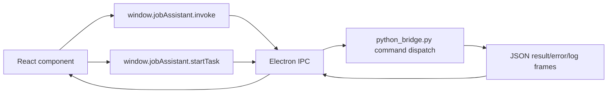
```mermaid
flowchart LR
    React["React component"] --> Invoke["window.jobAssistant.invoke"]
    React --> StartTask["window.jobAssistant.startTask"]
    Invoke --> IPC["Electron IPC"]
    StartTask --> IPC
    IPC --> Python["python_bridge.py command dispatch"]
    Python --> Result["JSON result/error/log frames"]
    Result --> IPC
    IPC --> React
```

This boundary keeps UI rendering separate from scraping, LLM calls, database
access, and document generation.

## Privacy And Sharing Model

JSE is local-first and can contain sensitive data. Before sharing source or
build artifacts, review:

- API keys and provider settings
- local endpoint settings in `settings/local_llm_settings.json`
- local SQLite databases
- resumes, cover letters, and generated application documents
- browser/session profiles
- backups and packaged installers
- context corpus caches and extracted document text

Source files should remain free of personal details and live credentials.
Runtime data should stay ignored or be explicitly exported by the user.

## Operational Constraints

- Keep Electron GPU acceleration disabled so local LLMs can use GPU memory.
- Keep the Python worker stdout protocol clean.
- Prefer structured parsing and database helpers over ad hoc string manipulation.
- Keep scraper plugins optional and metadata-driven.
- Treat generated folders and installer copies as outputs, not source of truth.
